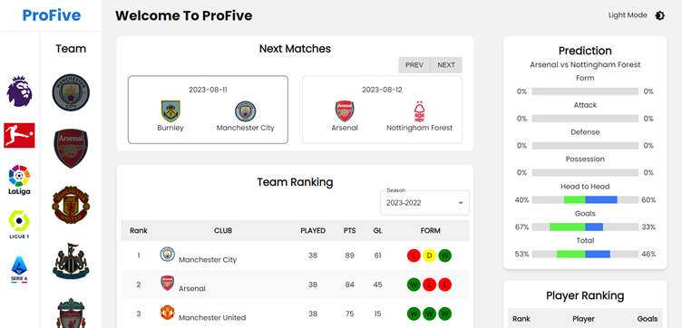
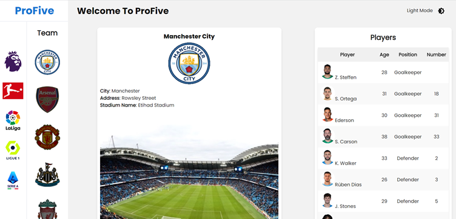
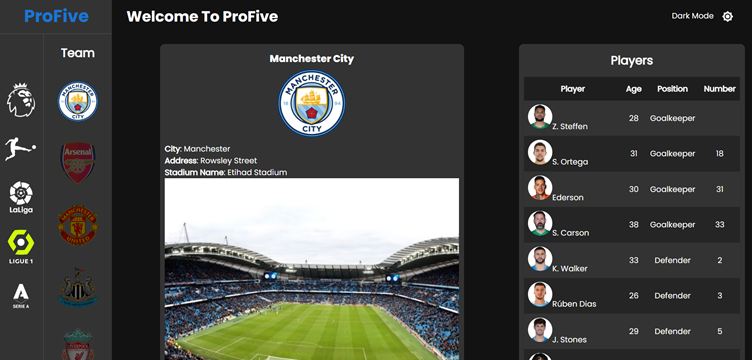

# 유럽 5대 축구리그

## 소개
- 세계 5대 축구 리그(영국, 스페인, 이탈리아, 독일, 프랑스)의 정보 공유
- 리그의 소속된 팀 순위, 개인 순위, 팀 정보, 최근 경기 예측 정보를 알 수 있음.
- 리그의 소속된 팀 정보, 팀의 선수들, 팀의 2023-2024 시즌 경기 일정을 알 수 있음.
- 5대 축구 리그에 대한 정보를 API로 불러옴 (참조: [API-SPORTS][api-sports Link])

## 웹 사이트 화면
|             홈              |
| :-------------------------: |
|  |

|             다크모드            |
| :-----------------------------: |
|  |

|               팀              |
| :---------------------------: |
|  |

|              다크모드               |
| :---------------------------------: |
|  |

|               경기 일정             |
| :---------------------------------: |
|  |

|                 다크모드               |
| :-------------------------------------: |
|  |

## 기술 스택

- React
- Redux Toolkit
- React Router
- Styled-Components
- MUI
- RTK Query: 하나의 API slice와 여러 개의 엔드 포인트들을 한 곳에 관리 가능하다.

  [api-sports Link]: <https://api-sports.io/>
