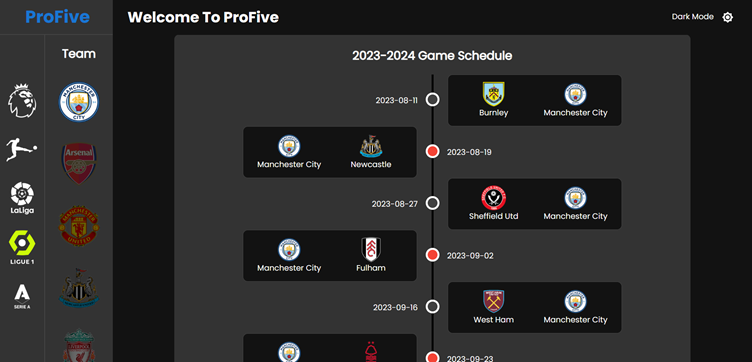
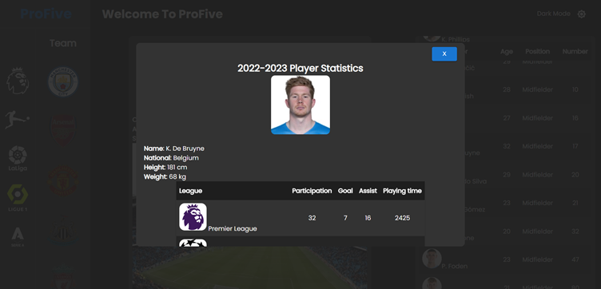

# 유럽 5대 축구리그

## 소개
- 세계 5대 축구 리그(영국, 스페인, 이탈리아, 독일, 프랑스)의 정보 공유
- 리그의 소속된 팀 순위, 개인 순위, 다음 경기, 최근 경기 예측 정보를 알 수 있음.
- 리그의 소속된 팀 정보, 팀의 선수들, 팀의 2023-2024 시즌 경기 일정을 알 수 있음.
- 5대 축구 리그에 대한 정보를 API로 불러옴 (참조: [API-SPORTS DOC][api-sports])
- 웹 페이지: [유럽 5대 리그][pro-five]

## 웹 사이트 화면
|            홈/다크모드         |
| :----------------------------: |
|     |
| |
| 팀 순위, 개인 순위, 다음 경기, 최근 경기 예측 정보를 보여준다.|

|              팀/다크모드            |
| :---------------------------------: |
|      |
|  |
| 팀 정보, 소속된 선수들, 선수들의 정보를 보여준다.|

|            경기 일정/다크모드          |
| :-------------------------------------: |
|      |
|  |
| 선택한 팀의 2023-2024 시즌 경기 일정을 보여준다.|

|          선수정보/다크모드       |
| :-------------------------------: |
|      |
|  |
| 선택한 선수의 세부 정보와 스텟을 보여준다. |

## 기술 스택

- React
- Redux Toolkit
- React Router
- Styled-Components
- MUI
- RTK Query: Redux Toolkit의 일부분으로, 데이터 가져오기와 관리를 단순화하고 최적화하는 데 도움을 주는 라이브러리이다.  
특히 비동기 작업을 처리하기 위한 비동기 상태, 오류 핸들링, 로딩 상태 등을 자동으로 관리해준다는 장점이 있다.

  [api-sports]: <https://api-sports.io/documentation/football/v3>
  [pro-five]: <https://dooohun.github.io/soccer-info/>
